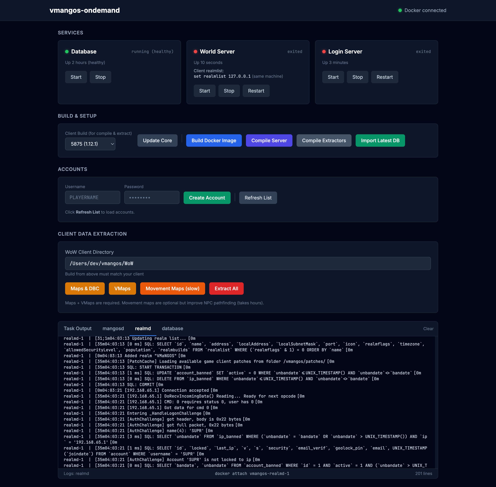

# vmangos-ondemand

One-command development environment for [VMaNGOS](https://github.com/vmangos/core), a Progressive Vanilla WoW server emulator.

A web control panel that handles cloning, compiling, database setup, client data extraction, and server management — all running in Docker on Ubuntu 24.04 LTS.



## Prerequisites

- [Docker Desktop](https://www.docker.com/products/docker-desktop/) (or Docker Engine + Compose)
- Python 3

## Quick Start

```
pip3 install flask
python3 panel/app.py
```

Open **http://localhost:5555** and follow the setup steps in order:

1. **Clone Core** — pulls vmangos/core from GitHub
2. **Build Docker Image** — creates the Ubuntu 24.04 build environment (~2 min)
3. **Compile Server** — builds mangosd and realmd from source
4. **Start Database** then **Import Latest DB** — downloads and imports the latest database dump from the vmangos release
5. **Extract Client Data** — point it at your WoW 1.12.1 client to extract maps, vmaps, and optionally mmaps
6. **Start** World Server and Login Server

## Services

| Service  | Port | Description                       |
|----------|------|-----------------------------------|
| panel    | 5555 | Web control panel (runs on host)  |
| mangosd  | 8085 | World server                      |
| realmd   | 3724 | Login/auth server                 |
| db       | 3306 | MariaDB 10.11                     |

## CLI Usage

Everything the panel does can be run directly:

```
git clone https://github.com/vmangos/core.git core
docker compose build
docker compose up -d db
docker compose run --rm db-import
docker compose run --rm build
docker compose up mangosd realmd
```

## Development Workflow

Edit C++ source in `core/`, then recompile and restart:

```
docker compose run --rm build
docker compose restart mangosd realmd
```

The build cache is preserved across runs for fast incremental builds.

## Project Layout

```
vmangos-ondemand/
├── panel/           Web control panel (Flask)
├── scripts/         Docker entrypoint scripts
├── Dockerfile       Ubuntu 24.04 build environment
├── docker-compose.yml
├── core/            vmangos source (cloned, gitignored)
├── server/          compiled output (gitignored)
└── data/            extracted client data (gitignored)
```

## Notes

- **MariaDB 10.11 LTS** is used instead of MySQL 5.6 for native ARM support (Apple Silicon). It is fully compatible with the MySQL 5.6 dumps that vmangos publishes.
- The default client build target is **1.12.1 (5875)**. Pass `CLIENT_BUILD=5464` (etc.) to the build service to target a different patch.
- Movement map generation (`mmaps`) is optional and takes several hours. Maps + VMaps are sufficient to start the server.
